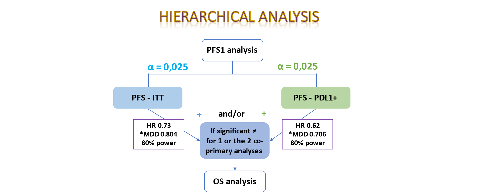
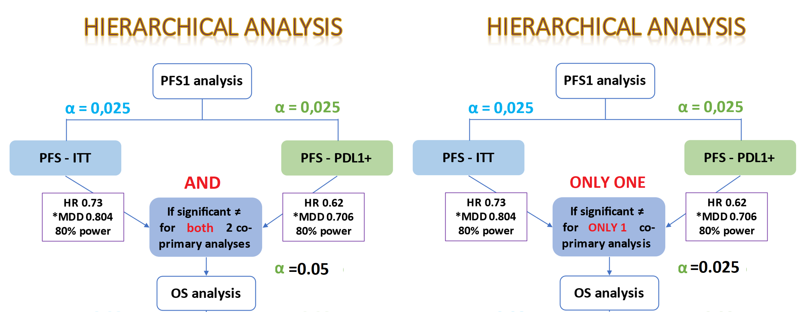
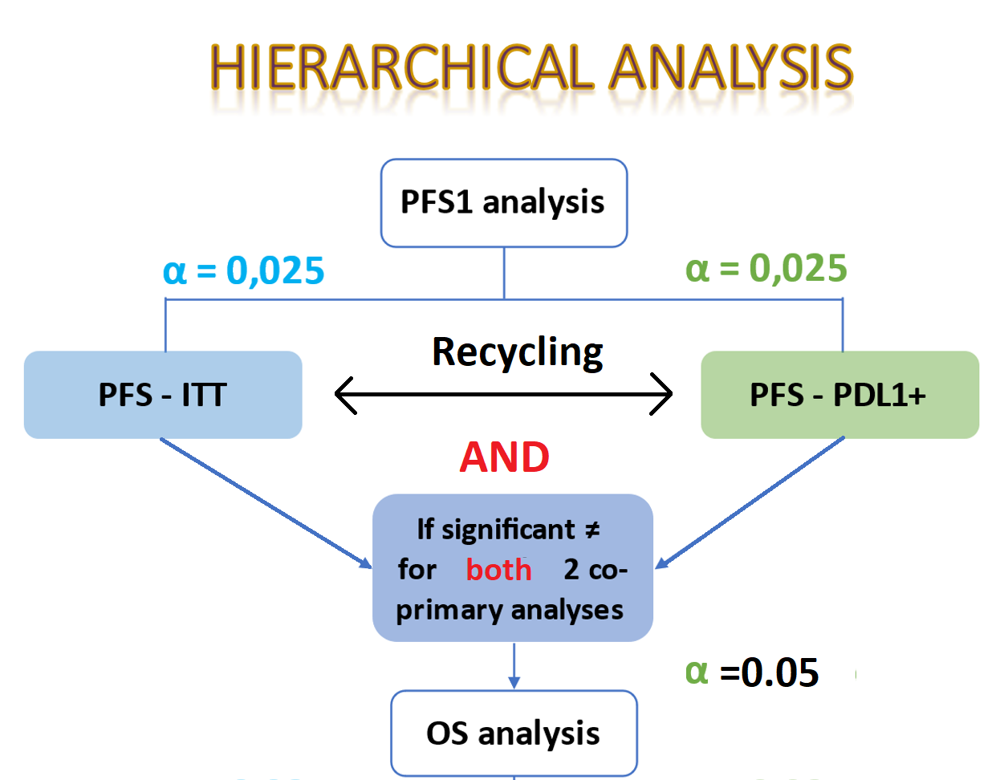

```{r,echo=F,message=F,warning=F}
rm(list=ls())
# source('ADA5W_OPTIMAL_MATCHING_12SEP2018_29522.R')
# source('ADA5W_TOLERANCE_MATCHING_12SEP2018_29522.R')
require(knitr)
require(haven)
require(magrittr)
require(gmodels)
require(tidyverse)
require(ldbounds)
require(gsDesign)
require(msm)
require(xlsx)
require(rpact)
require(survival)
require(survminer)
# source("../../../../../../../../Methods/R/survivalSampleSizeMisc.R")
# source('../../../../../../../../Methods/Surv/Non_PH/NPH.R')
knitr::opts_chunk$set(echo = TRUE, cache=FALSE, autodep=FALSE)
# source("https://raw.github.roche.com/adaptR/adaptR-tutorials/master/simpleBoundarySummary.R")
set.seed(21)
```


# Simulation demonstrating type-I error inflation for OS and PFS May 2021

For our simulation we assume that the null hypotheses for PFS ITT and OS ITT are true while that for PFS PDL1+ is false with the true HR for PFS PDL1+ being 0.62. The prevalence of PDL1+ is varied between 40% (assumption in protocol v10) and 11% based on our current discussion. With this known prevalence, the standardized log-rank statistics for PFS in PDL1+ and ITT follow multivariate normal distribution with correlation coefficient being a function of the PDL1 prevalence (see formulae (1) and (2) of https://www.sciencedirect.com/science/article/pii/S155171442030327X#! or Chapter 3 of Group Sequential Methods with Applications to Clinical Trials. Christopher Jennison and Bruce W. Turnbull). 

Furthermore, for simplicity we consider only one OS analysis in the ITT and assume that the standardized log-rank statistics of OS and PFS endpoints follow multivariate normal distribution. The correlation between the standardized log-rank statistics of OS ITT and each of PFS PDL1+ and PFS ITT are assumed across a matrix of paired values ranging from 0.1 to 0.8.

```{r,echo=T,message=F,warning=F}
require(tidyverse)
require(mvtnorm)
require(knitr)

hr_pfs_pdl1 <- 0.62
hr_pfs_itt  <- 1
hr_os_itt   <- 1

prev_pdl1s   <- c(.4, 0.11)

ev_pfs_itt  <- 490
ev_os_itt   <- 490

# correlation between OS ITT and PFS ITT/PDL1+
cor_pfs_pdl1_os_itts  <- seq(0.1, .8, 0.1)
cor_pfs_itt_os_itts   <- seq(0.1, .8, 0.1)

# see formulae (1) and (2) of https://www.sciencedirect.com/science/article/pii/S155171442030327X#! or Chapter 3 of Group Sequential Methods with Applications to Clinical Trials. Christopher Jennison and Bruce W. Turnbull.

fac <- (1/3 * (1 - 1/3)) ^ (-1)

res <- res2 <- res3 <- list()

for (prev_pdl1 in prev_pdl1s) {
  
  ev_pfs_pdl1 <- (490*prev_pdl1) %>% ceiling
  mean_vec <- c(log(hr_pfs_pdl1) * sqrt(ev_pfs_pdl1/fac), log(hr_pfs_itt) * sqrt(ev_pfs_itt/fac), log(hr_os_itt) * sqrt(ev_os_itt/fac))
  
  res[[prev_pdl1 %>% as.character]] <- res2[[prev_pdl1 %>% as.character]] <- res3[[prev_pdl1 %>% as.character]] <- matrix(NA, nrow=length(cor_pfs_pdl1_os_itts), ncol=length(cor_pfs_itt_os_itts))
  
  for (id1 in 1:length(cor_pfs_pdl1_os_itts)) {
    
    for (id2 in 1:length(cor_pfs_itt_os_itts)) {
      
      cor_pfs_pdl1_os_itt  <- cor_pfs_pdl1_os_itts[id1]
      cor_pfs_itt_os_itt   <- cor_pfs_itt_os_itts[id2]
      
      covmat <- rbind(
        c(1,                            sqrt(ev_pfs_pdl1/ev_pfs_itt), cor_pfs_pdl1_os_itt),
        c(sqrt(ev_pfs_pdl1/ev_pfs_itt), 1,                            cor_pfs_itt_os_itt ),
        c(cor_pfs_pdl1_os_itt,          cor_pfs_itt_os_itt,           1)
      )
      
      
      n_sim <- 1e5
      set.seed(21)
      
      # sim based - pmvnorm might not be stable
      simdat <- rmvnorm(n=n_sim, mean=mean_vec, sigma=covmat)
      colnames(simdat) <- c('LR stat PFS_PDL1', 'LR stat PFS_ITT', 'LR stat OS_ITT')
      
      # current proposal which inflates type-I error
      res[[prev_pdl1 %>% as.character]][id1, id2] <-
      (sum(pnorm(simdat[,'LR stat PFS_ITT'], lower.tail = T) <=.025/2) +  
       sum(pnorm(simdat[,'LR stat PFS_ITT'], lower.tail = T) >.025/2 & pnorm(simdat[,'LR stat PFS_PDL1'], lower.tail = T) <=.025/2 & pnorm(simdat[,'LR stat OS_ITT'], lower.tail = T) <=.05/2)
       
       ) / n_sim * 2
      
      # correct method without alpha recyling between PFS populations
      res2[[prev_pdl1 %>% as.character]][id1, id2] <-
      (sum(pnorm(simdat[,'LR stat PFS_ITT'], lower.tail = T) <=.025/2) +  
       sum(pnorm(simdat[,'LR stat PFS_ITT'], lower.tail = T) >.025/2 & pnorm(simdat[,'LR stat PFS_PDL1'], lower.tail = T) <=.025/2 & pnorm(simdat[,'LR stat OS_ITT'], lower.tail = T) <=.025/2) 
       ) / n_sim * 2    
      
      # correct method with alpha recyling between PFS populations
      res3[[prev_pdl1 %>% as.character]][id1, id2] <-
      (sum(pnorm(simdat[,'LR stat PFS_ITT'], lower.tail = T) <=.025/2 & pnorm(simdat[,'LR stat PFS_PDL1'], lower.tail = T) >.025/2) +
       sum(pnorm(simdat[,'LR stat PFS_ITT'], lower.tail = T) <=.05/2 & pnorm(simdat[,'LR stat PFS_PDL1'], lower.tail = T) <=.025/2) 
  
       ) / n_sim * 2
     
    } # end of for (id2 in 1:length(cor_pfs_itt_os_itts))
  } # end of for (id1 in 1:length(cor_pfs_pdl1_os_itts))   
  
  rownames(res[[prev_pdl1 %>% as.character]]) <- rownames(res2[[prev_pdl1 %>% as.character]]) <- rownames(res3[[prev_pdl1 %>% as.character]]) <- cor_pfs_pdl1_os_itts
  
} # end of for (prev_pdl1 in prev_pdl1s) 


```

# Results

For all approaches, type I error inflation is less severe when PD-L1 prevelance is low as this leads to a low correlation between PFS in ITT and PD-L1+, hence a rejection in PD-L1+ would less likely lead to a rejection in PFS ITT for lower PDL1+ prevalence.

## Current proposal which inflates type I error

This inflates type I error as the full $\alpha$ of 5% is passed to OS regardless of if only one or both of the nulls for PFS is rejected.



```{r,echo=T,message=F,warning=F, results='asis'}

for (prev in prev_pdl1s) {
  res[[prev %>% as.character]] %>% kable(col.names = cor_pfs_itt_os_itts, caption = paste('PDL1+ prevalence =', prev)) %>% print  
}

```


## Correct method WITHOUT alpha recyling between PFS populations

This protects type-I error for the scenarios under consideration as only $\alpha$ of 2.5% is passed to OS in case only one of the PFS nulls is rejected. The full 5% is passed only when both PFS nulls are rejected. This method is however rather conservative as no $\alpha$ recycling between PFS analyses is considered.



```{r,echo=T,message=F,warning=F, results='asis'}

for (prev in prev_pdl1s) {
  res2[[prev %>% as.character]] %>% kable(col.names = cor_pfs_itt_os_itts, caption = paste('PDL1+ prevalence =', prev)) %>% print  
}
```

## Correct method WITH alpha recyling between PFS populations

This protects type-I error for the scenarios under consideration and is not as conservative as it allows for recycling of $\alpha$ between ITT and PD-L1+, which enables a full $\alpha$ test in one population if the null of the other is rejected. Please note under this approach, formal testing of OS can only be performed once BOTH PFS analyses are statistically significant.

In any case, this approach is mostly in line with the proposal in our current protocol. For registration, there should not be major discrepancies in type I error control approach between the protocol and the SAP.



```{r,echo=T,message=F,warning=F, results='asis'}

for (prev in prev_pdl1s) {
  res3[[prev %>% as.character]] %>% kable(col.names = cor_pfs_itt_os_itts, caption = paste('PDL1+ prevalence =', prev)) %>% print  
}
```